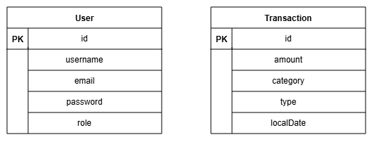
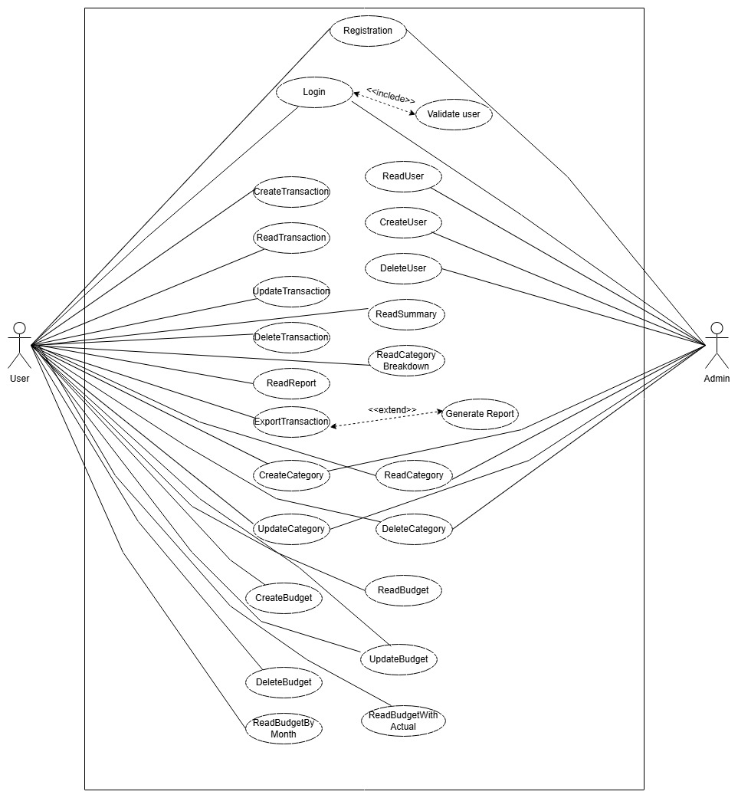

# Personal Finance Tracker API (Backend)

A secure, scalable, and production-ready RESTful API built with Spring Boot for managing personal finances, including income, expenses, and financial reports.

---

## 🌐 Live API

**Base URL:**  
👉 https://personal-finance-tracker-backend-brs4.onrender.com

---

## 📚 API Documentation

- 🔗 **Swagger UI:**  
  https://personal-finance-tracker-backend-brs4.onrender.com/swagger-ui/index.html  
- 📄 **OpenAPI JSON:**  
  https://personal-finance-tracker-backend-brs4.onrender.com/v3/api-docs  

---

## 🚀 Quick Links

| Type           | Link                                                                 |
|----------------|----------------------------------------------------------------------|
| API Root       | https://personal-finance-tracker-backend-brs4.onrender.com           |
| Health Check   | https://personal-finance-tracker-backend-brs4.onrender.com/actuator/health |

---

## 🔗 Frontend Repository

👉 https://github.com/hasibulhimu49/personal-finance-tracker-frontend  

---
---

## 📌 Overview

This backend system enables users to track financial activities, categorize transactions, and generate insightful reports.  
It follows clean architecture principles with a focus on scalability, maintainability, and security using JWT-based authentication.

---

## ✨ Features

- 🔐 JWT Authentication & Authorization  
- 👤 User Registration & Login  
- 💸 Income & Expense Management  
- 🗂️ Category-based Transactions  
- 📊 Monthly Financial Reports  
- ✅ Input Validation & Global Exception Handling  

---

## 🛠️ Tech Stack

- **Backend:** Java 21, Spring Boot 3  
- **Security:** Spring Security, JWT  
- **Database:** PostgreSQL (Neon)  
- **Build Tool:** Gradle  
- **API Docs:** Swagger (OpenAPI 3)  
- **Testing:** Postman  

---

## 🧩 Engineering Best Practices

- ✅ DTO Pattern & Mapper Layer (MapStruct)  
- ✅ Service Interface (Loose Coupling)  
- ✅ Layered Architecture (Clean Code)  
- ✅ Environment-based Profiles (Dev/Prod)  
- ✅ Database Migration using Flyway  
- ✅ Structured Logging  
- ✅ Global Exception Handling  

---

## 🧠 System Architecture

This project follows a layered architecture ensuring separation of concerns:

Client → Controller → Service → Repository → Database  

---

## 🗄️ ER Diagram (Initial Basic)

 

---

## 🔄 Use Case Diagram (Initial Basic)

  

---

## 🗄️ Database Design

The database is designed to efficiently manage user financial data with proper relationships and normalization.

### Main Entities

- **User**  
  Stores user authentication and profile information.

- **Transaction**  
  Represents income and expense records, including amount, type, and date.

### Relationships

- A **User** can have multiple **Transactions** (One-to-Many)  

This design ensures data integrity, scalability, and efficient querying for financial reports.

---

## 🔗 API Endpoints

### 🔐 Authentication API (`/api/v1/auth`)

| Method | Endpoint | Description | Auth |
|--------|----------|------------|------|
| POST | /register | Register new user | ❌ |
| POST | /login | Login & receive JWT | ❌ |
| POST | /logout | Logout user | ✅ |

---

### 👥 User Management (`/api/v1/users`)

| Method | Endpoint | Description | Auth |
|--------|----------|------------|------|
| GET | / | Get all users (ADMIN) | ✅ |
| POST | / | Create user (ADMIN) | ✅ |
| GET | /{id} | Get user by ID | ✅ |
| DELETE | /{id} | Delete user (ADMIN) | ✅ |

---

### 💰 Transactions (`/api/v1/transactions`)

| Method | Endpoint | Description | Auth |
|--------|----------|------------|------|
| GET | / | Get all transactions | ✅ |
| POST | / | Create transaction | ✅ |
| GET | /{id} | Get transaction by ID | ✅ |
| PUT | /{id} | Update transaction | ✅ |
| DELETE | /{id} | Delete transaction | ✅ |

---

### 📊 Reports

| Method | Endpoint | Description |
|--------|----------|------------|
| GET | /reports/monthly?month={month}&year={year} | Monthly income/expense report |

📌 Example:  
`/api/v1/transactions/reports/monthly?month=4&year=2026`

---

### 🏠 System Endpoints

| Endpoint | Description |
|----------|------------|
| `/swagger-ui/index.html` | API documentation |
| `/v3/api-docs` | OpenAPI JSON |
| `/actuator/health` | Health check |

---

## 🔑 Authorization

For secured endpoints, include JWT token in header:
- Authorization: Bearer <your_jwt_token>

---

## 🔐 Authentication & Security

- JWT-based authentication  
- Stateless session management  
- Secure endpoints with Spring Security  
- Role-based access control  

---

## ⚙️ Setup Instructions

### Prerequisites

- Java 17+  
- Gradle  
- PostgreSQL  

### Steps

1. Clone the repository:
git clone https://github.com/hasibulhimu49/finance-tracker-backend.git

3. Configure database in `application.yaml`

4. Run the project:
   ./gradlew bootRun

---

## 🚀 Deployment

- **Backend:** Render  
- **Database:** Neon (PostgreSQL)  

---

## 🚀 Future Improvements

- 📊 Budget Planning Feature  
- 📄 Export Reports (PDF/Excel)  
- ⚡ Redis Caching  

---

## 👨‍💻 Author

**Mohammad Hasibul Hasan**  
Java Backend Developer  

- 🔗 LinkedIn: https://www.linkedin.com/in/hasibulhimu49/  
- 💻 GitHub: https://github.com/hasibulhimu49  
- 🌐 Portfolio: https://hasibul-dev-portfolio.vercel.app/  

---

## ⭐ Support

If you like this project, consider giving it a ⭐ on GitHub!

